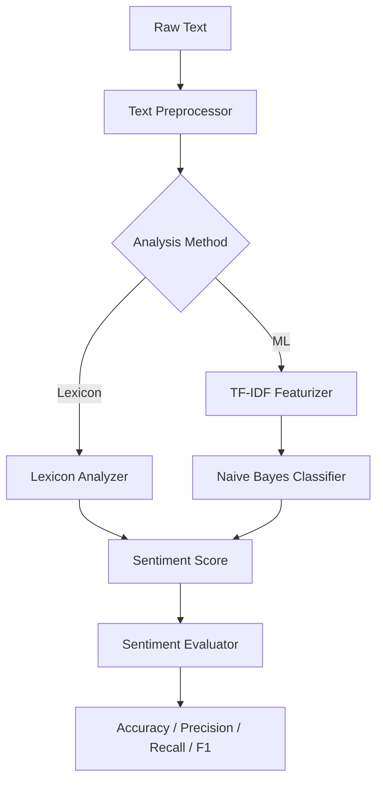
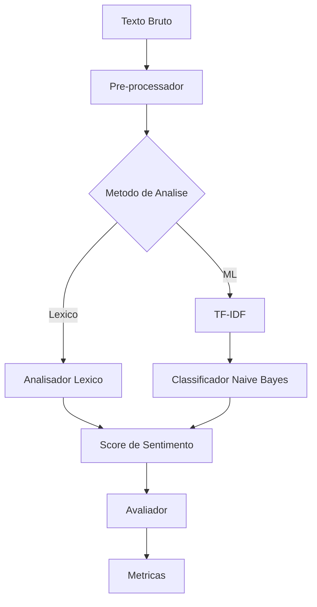

# NLP Sentiment Analysis Pipeline

<div align="center">


</div>

**[English](#english)** | **[Portugues (BR)](#portugues-br)**

---

## English

### Overview

A complete sentiment analysis pipeline implementing lexicon-based analysis (VADER-inspired), Naive Bayes classification, TF-IDF feature extraction, text preprocessing, and evaluation metrics. Built from scratch in Python without heavy dependencies.

### Architecture


```mermaid
graph TD
    A[Raw Text] --> B[Text Preprocessor]
    B --> C{Analysis Method}
    C -->|Lexicon| D[Lexicon Analyzer]
    C -->|ML| E[TF-IDF Featurizer]
    E --> F[Naive Bayes Classifier]
    D --> G[Sentiment Score]
    F --> G
    G --> H[Sentiment Evaluator]
    H --> I[Accuracy / Precision / Recall / F1]
```

### Features

- **Lexicon-based Analysis**: Scoring with negation detection and intensifier handling
- **Naive Bayes Classifier**: Multinomial NB with Laplace smoothing
- **TF-IDF Features**: Document vectorization for ML classification
- **Text Preprocessing**: Tokenization, lowercasing, stop word removal
- **Evaluation**: Accuracy, per-class precision, recall, and F1

### Running Tests

```bash
pytest tests/ -v
```

### Author

**Gabriel Demetrios Lafis** - [GitHub](https://github.com/galafis)

---

## Portugues BR

### Visao Geral

Um pipeline completo de analise de sentimento implementando analise baseada em lexico (inspirada no VADER), classificacao Naive Bayes, extracao de features TF-IDF, pre-processamento de texto e metricas de avaliacao. Construido do zero em Python.

### Arquitetura


```mermaid
graph TD
    A[Texto Bruto] --> B[Pre-processador]
    B --> C{Metodo de Analise}
    C -->|Lexico| D[Analisador Lexico]
    C -->|ML| E[TF-IDF]
    E --> F[Classificador Naive Bayes]
    D --> G[Score de Sentimento]
    F --> G
    G --> H[Avaliador]
    H --> I[Metricas]
```

### Funcionalidades

- **Analise Lexical**: Pontuacao com deteccao de negacao e intensificadores
- **Naive Bayes**: Classificador multinomial com suavizacao de Laplace
- **TF-IDF**: Vetorizacao de documentos para classificacao ML
- **Pre-processamento**: Tokenizacao, remocao de stop words
- **Avaliacao**: Acuracia, precisao, recall e F1 por classe

---

## License

MIT License - see [LICENSE](LICENSE) for details.
